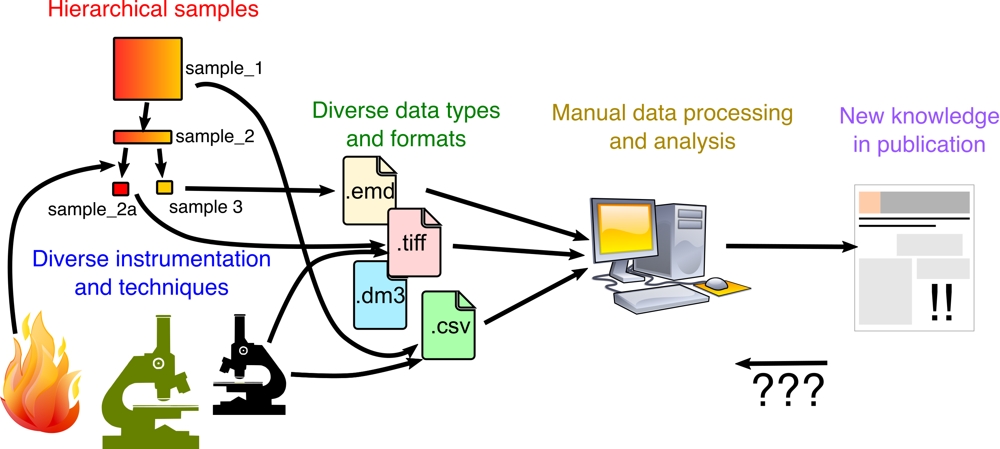

<p align="left">
<a href="https://github.com/din14970/elabftwcontrol/actions"></a>
<a href="https://pypi.org/project/elabftwcontrol/"></a>
<a href='https://coveralls.io/github/din14970/elabftwcontrol?branch=master'></a>
<a href="https://github.com/psf/black"></a>
</p>

# Elabftwcontrol

Elabftwcontrol is a library and CLI tool for interacting with the popular electronic lab notebook (ELN) software [eLabFTW](https://www.elabftw.net/), **with a special focus on the metadata feature**.
It works by implementing higher level abstractions on top of the basic [api](https://github.com/elabftw/elabapi-python/).
The main goals are:

* easily **extracting data** from eLabFTW in **tabular formats: parquet, csv, and even Excel**.
* **managing eLabFTW state** (like templates and item types) **declaratively** with yaml definition files

It is a 3rd party tool not officially supported by eLabFTW maintainers.

> ⚠️  Elabftwcontrol should not to be confused with [elabctl](https://github.com/elabftw/elabctl), the official tool for managing an eLabFTW installation.

## Motivation

A very common problem faced by researchers who work in the lab is how to keep track of their work.
Researchers must somehow keep an overview of physical samples, experiments, data, projects, suppliers, collaborators, and more, as well as all their interrelationships.
Eventually, all research efforts start resembling a graph structure.



The most diligent researchers track all of their work in a physical notebook.
Still, this makes it difficult to keep track of everything at the level of a team, or do perform analyses or queries on the information.
In an attempt to create some structure in the mess, data is often collected in non-standardized Excel sheets (many times unironically called "databases").
The proliferation of interrelated Excel sheets creates a second order mess.

What lab researchers actually need is a proper centralized database like PostgreSQL with transactions and enforced constraints (primary keys, foreign keys, uniqueness constraint, ...).
However, few lab researchers have the technical skills to effectively use such a database.
To make a real database viable, someone would need to build a graphical user interface (GUI) on top.
This is time consuming and prohibitively expensive in an environment where data models are constantly in flux like in research.

[eLabFTW](https://www.elabftw.net/) provides a promising middle ground solution.
It has an intuitive GUI on top of a relational database that allows all researchers and technicians in a team to centrally track their data and workflows.
eLabFTW can be used to keep track of physical resources (like samples and instruments), protocols, experiments, data and more.
There is no need for an a-priori fixed data schema; "item types" can be created as needed by the user.
It has an API that allows developers to build workflows to transform the data to something else, or to automate data recording from lab equipment.
Finally, the really interesting feature that has been introduced relatively recently is the ability to add **structured metadata** to entries by defining custom forms.
Inside structured metadata fields, it is possible to link to other entries.
This allows us to use eLabFTW to directly represent the graph structure of the underlying research.

Two issues that eLabFTW does not solve with respect to spreadsheets or directly using a relational database:

* You can not use eLabFTW to directly **analyze** data (e.g. with aggregations or visualizations). There is some search feature, but this is not equally flexible as SQL.
* Managing templates with structured metadata and their versions can be cumbersome. As templates evolve, items of the same category start to drift.

This package, Elabftwcontrol aims to address both these issues.

## Installation
You can install elabftwcontrol with pip (if you will use it as a library) or pipx or uv (if you will use it via the CLI):

```
$ pip install elabftwcontrol

or

$ pipx install elabftwcontrol

or

$ uv tool install elabftwcontrol
```

If you want to be able to write to Excel or AWS S3, you must provide these as optional dependency groups: `elabftwcontrol[excel,aws]`.

## Usage

### CLI

Use the `elabftwctl` command to interact with eLabFTW. Check out the options via `--help`.

#### Configuring and managing profiles

In order to connect to eLabFTW, you must tell Elabftwcontrol which endpoint and token it should use.
Elabftwcontrol stores this information in `~/.elabftwcontrol.json` in the form of different "profiles".
Create a new profile with

```
$ elabftwcontrol config set --profile <profile name>
```

You will be prompted for the API endpoint and the token.
If you do not provide a name with `--profile`, the name `default` will be chosen.
If you choose a profile that already exists, it will be overwritten.

You can list your profiles with

```
$ elabftwcontrol config list
```

You can delete a profile with

```
$ elabftwcontrol config delete --profile <profile name>
```

#### Extracting data

At this moment, only items, experiments, item types and experiment templates are supported

```
$ elabftwctl get [OPTIONS] {item|items_type|experiment|experiments_template}
```

To tell Elabftwcontrol which connection you want to use, use the `--profile` option.
Alternatively, you can set the `ELABCTL_HOST_URL` and `ELABCTL_API_KEY` environment variables.

By default, data is simply extracted as JSON and dumped to the console.
To change this behavior you must pass `--format` and `--output` options.

```
# Change the format in which you want to store the data
--format    [json|csv|excel|parquet]

# Provide an output path
--output    TEXT
```

If you choose the `excel` format, items and experiments of different types will be split into different sheets.
In the other tabular formats, all items are collected in one table.

If the path starts with `s3://` and you have the optional `aws` dependencies installed, you can store data directly on AWS S3.
If you use tabular contents `csv` or `parquet`, you can also register the table in an AWS Glue database using the `--glue-table <GLUE DB>:<GLUE TABLE>` option.

If you do not provide any output, the output will be stdout.
You can use this with pipes and redirects in a shell, for example:

```
$ elabftwctl get items --format csv > my_data.csv
```

There are a few options for limiting the output data:

```
# Limit the download to this ID. If you want multiple, provide the argument multiple times.
--id        INTEGER

# Only download items or experiments from the item category or experiment template with this name. Not relevant when downloading item types or experiment templates.
--category  TEXT
```

> ⚠️  Experiments do not store any link to the template from which they originate.
> This means that there is no robust way to determine which experiment came from which template.
> Elabftwcontrol assumes that the template title appears in the experiment title, and filters based on this criterion.
> It also means that for experiments, we always download all data.


The rest of the options influence how the data is transformed to and represented in the output.
For `json` output, there is only one relevant option:

```
# Whether or not to indent the JSON. Default is that one item = one line.
--indent
```

For tabular formats, the options are as follows:

```
# If passed, metadata fields are parsed and added to the table as columns. By default,
# metadata is a single JSON string in one column.
--expand-metadata

# If you expand metadata fields, you have the option to represent the data in "long" form,
# whereby all values are stored as strings in a single column. The benefit of this table
# form is that the schema is constant. In "wide" form, all metadata fields are split into
# different columns.
--table-shape   [wide|long]

# If you use the "wide" table shape, this option ensures that the columns match those of the
# columns in the template. Otherwise, the table columns represent the union of all fields in
# all downloaded entities.
--use-template-metadata-schema

# In "wide" table formats, this option allows you to select what to put in the table.
# By default it is simply the "value" of the field, but this could be problematic for fields
# with units. With "unit", the unit is put into the table instead, and with "combined" fields
# with units are represented as a string formated as "<value> <unit>".
--cell-content  [value|unit|combined]

# If you are storing your table on AWS Glue, table names can not contain special characters.
# This option cleans the names of the columns (field names) in wide table formats.
--sanitize-column-names
```

#### Defining and applying state

>⚠️ This functionality is very similar to what a [Terraform](https://www.terraform.io/) provider would do.
> Therefore, the intention is that this functionality will be migrated in the future to a proper TF provider.
> This package would then still exist to transform the YAML manifests to HCL.

To declare items, experiments, item types and experiment templates, you must write one or multiple YAML files.
As an example, to create a new item type and two derivative items:

```yaml
- id: my_item_type
  kind: items_type
  spec:
    title: My item type
    color: '#00ff00'
    extra_fields:
      config:
        display_main_text: true
      fields:
      - name: field 1
        readonly: true
        type: text
        value: 'something'
      - group_name: Field group
        sub_fields:
        - description: The second field
          name: field 2
          type: checkbox
          value: 'off'
        - name: field 3
          type: text
        - name: field 4
          type: items

- id: my_item
  kind: item
  spec:
    title: My item 1
    category: my_item_type
    extra_fields:
      field_values:
        "field 2": "on"
        "field 4": my_second_item

- id: my_second_item
  kind: item
  spec:
    title: My item 2
    category: my_item_type
    extra_fields:
      field_values:
        "field 3": "Third field value"
```

Every entity you want to create must at least have an `id`, `kind` and `spec`.
The `id` is the internal reference name for the entity, and can be used inside other entity definitions.
The `kind` is the type of entity, so one of `item`, `items_type`, `experiment`, and `experiments_template`.
The `spec` is the specification of the entity, which differs by entity.
For all entities you can set a title and extra fields.
But only for item types you can set a color.
Making it well documented which options you can set is a work in progress.

The extra_fields is really the key of what makes Elabftwcontrol convenient.
The YAML definition is much more compact than the JSON definition in eLabFTW.
In the item_type or template, you define the template similar to how you would do it in eLabFTW JSON.
However, field order/position is conserved, and you can declare field groups more naturally.
In derivative items, you can also define `fields` as you would in the template/type, but there is also the short-hand `field_values`, which allows you to simply fill in values for fields defined in the template.

To materialize these entities in eLabFTW, you use the command

```
$ elabftwctl apply <folder containing YAML files> --profile <profile name>
```

First the state in eLabFTW is checked.
This is compared to the defined state.
Elabftwcontrol will then try to figure out the difference, and calculate a work plan to reconcile this difference.

When you don't have anything in your eLabFTW instance managed by Elabftwcontrol, you should see something like:

```
The following is the work to be done:

+ Creation of new items_type: my_item_type
~ Patching of items_type: my_item_type (ID unknown)

    Main fields
    -----------
    + title: My item type
    + color: ff0000

    Metadata fields
    ---------------
    + field 4:
        + value:
        + type: items
        + position: 3
        + group_id: 1
    + field 1:
        + value: something
        + type: text
        + position: 0
        + readonly: True
    + field 3:
        + value:
        + type: text
        + position: 2
        + group_id: 1
    + field 2:
        + value: off
        + type: checkbox
        + description: The second field
        + position: 1
        + group_id: 1

+ Creation of new item: my_second_item
~ Patching of item: my_second_item (ID unknown)

    Main fields
    -----------
    + title: My item 2

    Metadata fields
    ---------------
    + field 4:
        + value:
        + type: items
        + position: 3
        + group_id: 1
    + field 1:
        + value: something
        + type: text
        + position: 0
        + readonly: True
    + field 3:
        + value: Third field value
        + type: text
        + position: 2
        + group_id: 1
    + field 2:
        + value: off
        + type: checkbox
        + description: The second field
        + position: 1
        + group_id: 1

+ Creation of new item: my_item
~ Patching of item: my_item (ID unknown)

    Main fields
    -----------
    + title: My item 1

    Metadata fields
    ---------------
    + field 4:
        + value: Unknown
        + type: items
        + position: 3
        + group_id: 1
    + field 1:
        + value: something
        + type: text
        + position: 0
        + readonly: True
    + field 3:
        + value:
        + type: text
        + position: 2
        + group_id: 1
    + field 2:
        + value: on
        + type: checkbox
        + description: The second field
        + position: 1
        + group_id: 1

Do you wish to apply the changes? [Y|n]
```

Basically, all we will do is create an item type and two items.
Things that are not yet known, like IDs in eLabFTW are indicated as Unknown.

When you select `Y`, the work plan will be executed and the state is applied.
You can go check in eLabFTW that the items type and items exist as specified.

The magic happens when you make changes to the manifests.
For example, if you edit the item type color to "#00ff00", and you run `apply` again, you will see the following:

```
~ Patching of items_type: my_item_type (24)

    Main fields
    -----------
    ~ color: ff0000 -> 00ff00

Do you wish to apply the changes? [Y|n]
```

This means you only have to worry about declaring your templates (and some items) in a very minimal syntax, and eLabFTW takes care of doing the right API calls.

You can destroy all declared things by passing the `--destroy` flag.
Elabftwcontrol takes care to do things in the correct order.

How does Elabftwcontrol *know* which items and templates to update? This is done by injecting an additional bit of data in the metadata. Under `elabftwcontrol`, we store the manifest `id` as well as a `version`. In this way, Elabftwcontrol can keep track of which eLabFTW ids correspond to which manifest ids. At this moment, Elabftwcontrol does not maintain a separate state file like terraform, which means that all `apply` operations must gather all the state directly from eLabFTW.

The `version` stored in the metadata can be either passed through the CLI, or is parsed automatically from the git hash if your manifests are tracked by git.
In this way, if your template evolves, you will be able to associate it back to a git hash, and you will be able to distinguish which items correspond to the same version of the template.

### Python

Documentation and examples are a work in progress, at this moment you will have to look through the code.
The main reason you would use Elabftwcontrol as a library, is to download the data directly as a `pandas` dataframe.
This can be done as follows:

```python
from elabftwcontrol.client import ElabftwApi
from elabftwcontrol.download import (
    get_experiment_templates_as_df,
    get_experiments_as_df,
    get_item_types_as_df,
    get_items_as_df,
)

# if you have created profiles with the CLI
client = ElabftwApi.from_config_file(profile="profile name")

# if you have not
client = ElabftwApi.new(host_url="api endpoint", api_key="my token")

items = get_items_as_df(client=client)
```

The options that can be passed to these functions correspond closely to what can be passed with CLI arguments.
